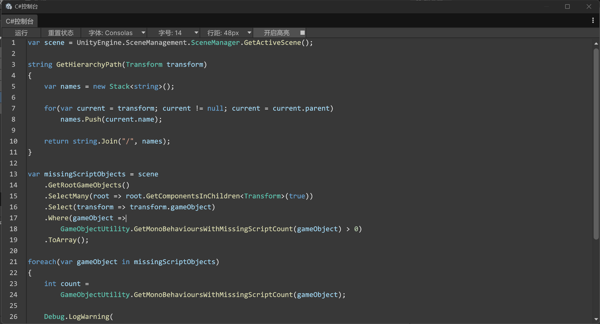
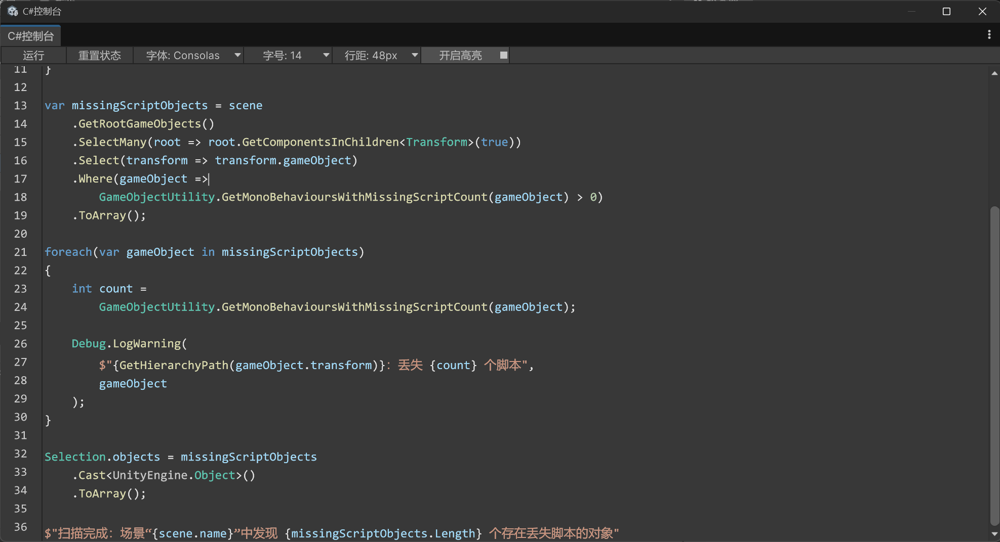

## unity快速控制台

自己手搓了一个unity控制台，主要目的是方便一次性代码的执行, 不用再临时写cs文件；

界面用UI Toolkit编写。

### 安装
在unity 包管理器中，输入 https://github.com/skynetXDU/unityfastconsole.git 进行安装；

### 功能
1. 便捷执行一次性代码；
2. 代码高亮（效果接近vscode）；
3. 代码补全；
4. 自动缩进控制；
5. 显示行号；
6. 可调字体、行距、可开关代码高亮；

### 该项目不是什么：
* 该项目不是给unity造了一个原生编辑器, cs脚本仍然依赖外部编辑器；
* 本项目只是方便了一次性代码的执行，执行那种一次性代码时不再需要建cs、编译、执行

### 使用
* 安装并编译后，打开工具栏的“Tools/快速控制台”即可开始编写代码；
* 如果您的unity是汉化版，那么打开工具栏的“工具/快速控制台”

### 效果


图中的代码:
```csharp
var scene = UnityEngine.SceneManagement.SceneManager.GetActiveScene();

string GetHierarchyPath(Transform transform)
{
    var names = new Stack<string>();

    for(var current = transform; current != null; current = current.parent)
        names.Push(current.name);

    return string.Join("/", names);
}

var missingScriptObjects = scene
    .GetRootGameObjects()
    .SelectMany(root => root.GetComponentsInChildren<Transform>(true))
    .Select(transform => transform.gameObject)
    .Where(gameObject =>
        GameObjectUtility.GetMonoBehavioursWithMissingScriptCount(gameObject) > 0)
    .ToArray();

foreach(var gameObject in missingScriptObjects)
{
    int count =
        GameObjectUtility.GetMonoBehavioursWithMissingScriptCount(gameObject);

    Debug.LogWarning(
        $"{GetHierarchyPath(gameObject.transform)}：丢失 {count} 个脚本",
        gameObject
    );
}

Selection.objects = missingScriptObjects
    .Cast<UnityEngine.Object>()
    .ToArray();

$"扫描完成：场景“{scene.name}”中发现 {missingScriptObjects.Length} 个存在丢失脚本的对象"
```
* 图示代码的功能：扫描当前场景中丢失脚本的 GameObject，输出完整层级路径，并自动选中它们；
* 点击“运行”，可直接运行；
* 点击“重置状态”，可放弃之前的执行结果，但不会清空控制台已有代码；
* 字体、字号、行距均可调；
* 高亮可开关

### 注意事项
* 第一次开始编辑代码可能会比较慢，后面就好了；
* 常用的命名空间，如`UnityEngine`、`UnityEditor`已自动添加，详见[Editor/CodeExec.cs](https://github.com/skynetXDU/unityfastconsole/blob/master/Editor/CodeExec.cs)文件的第40行附近；
* 代码高亮比较耗时，当代码行数很多时建议关掉实时高亮；
* 不建议在本控制台编辑大量代码；
* 清空本控制台之后，之前声明的变量、函数、类仍然可访问，但前提是清空本控制台之前必须点击了“运行”且执行成功；
* 关闭控制台之后再打开，上一次声明的变量、函数、类不再可访问，也就是说，代码执行状态仅存在于当前窗口，不可持久化；
* 这里的行距不是真的行距，虽然单位是px，但实际上数值表示的是行距相对于字体的百分比，因为unity UI Toolkit就是这么写的，我也不知道为什么要这么设定；